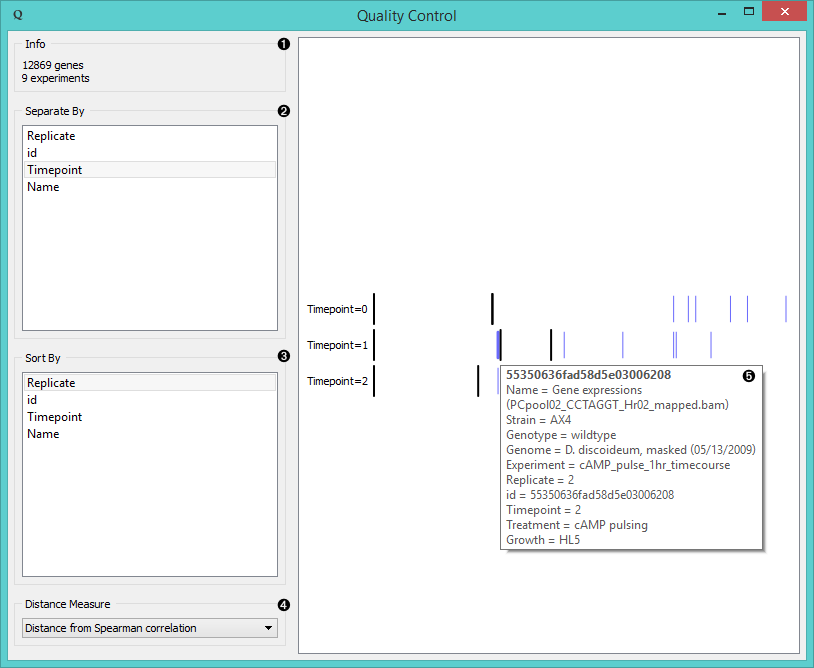

Quality Control
===============

Computes and plots distances between experiments or replicates.

Signals
-------

**Inputs**:

- **Data**

  Data set.

**Outputs**:

- (None)

Description
-----------

**Quality Control** measures distances between experiments (usually replicates) for a selected label. The widget visualizes
distances by selected label. Experiments that lie the farthest from the initial black line
should be inspected for anomalies.

1. Information on the input.
2. Separate experiments by label.
3. Sort experiments by label.
4. Compute distances by:
   - [**Pearson correlation**](https://en.wikipedia.org/wiki/Pearson_product-moment_correlation_coefficient)
   - [**Euclidean distances**](https://en.wikipedia.org/wiki/Euclidean_distance)
   - [**Spearman correlation**](https://en.wikipedia.org/wiki/Spearman%27s_rank_correlation_coefficient)
5. Hover over the vertical line to display the information on a chosen instance. Click on the black line to
   change the reference to that instance.

Example
-------

**Quality Control** widget gives us feedback on the quality of our data and can be connected to any widget with
data output. In the example above (see the image under *Description*) we fed 9 experiments of 
*Cyclic AMP pulsing* of *Dictyostelium discoideum* from **GenExpress** widget into **Quality Control**
and separated them by timepoint label. We found replicate 2 from tp 2 among the tp 1 data, meaning
we should inspect these data further.
