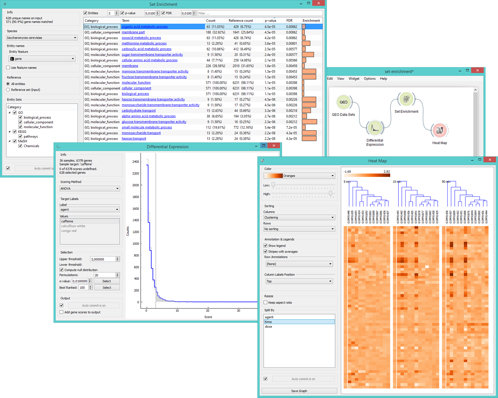

Set Enrichment
==============

Determines statistically significant differences in expression levels for biological processes.

Signals
-------

**Inputs**:

- **Data**

  Data set.

- **Reference**

  Data with genes for the reference set (optional).

**Outputs**:

- **Selected data**

  Data subset.

Description
-----------

The widget shows a ranked list of terms with [p-values](https://en.wikipedia.org/wiki/P-value), 
[FDR](https://en.wikipedia.org/wiki/False_discovery_rate) and 
[enrichment](https://en.wikipedia.org/wiki/Gene_set_enrichment). 
**Set Enrichment** is a great tool for finding biological processes that are over-represented in a particular gene 
or chemical set.

Sets from ([GO](http://geneontology.org/), [KEGG](http://www.genome.jp/kegg/), 
[miRNA](http://www.mirbase.org/) and [MeSH](http://www.nlm.nih.gov/mesh/MBrowser.html)) come with the Orange installation.

1. Information on the input data set and the ratio of genes that were found in the databases.
2. Select the species.
3. *Entity names* define the features in the input data that you wish to use for term analysis. Tick *Use feature names*
   if your genes or chemicals are used as attribute names rather than as meta attributes.
4. Select the reference data. You can either have entities (usually genes from the organism - *All Entities*)
   as a reference or a reference set from the input.
5. Select which *Entity sets* you wish to have displayed in the list.
6. When *Auto commit is on*, the widget will automatically apply the changes. Alternatively press *Commit*. 
7. Filter the list by:
   - the minimum number of **entities** included in each term
   - the minimum threshold for **p-value**
   - the maximum threshold for **false discovery rate**
   - a search word

Example
-------

In the example below we have decided to analyse gene expression levels from *Caffeine effect: time course
and dose response* data set. We used the ANOVA scoring in the **Differential Expression** widget to 
select the most interesting genes. Then we fed those 628 genes to **Set Enrichment** for additional
analysis of the most valuable terms. We sorted the data by FDR values and selected the top-scoring
term. **Heat Map** widget provides a nice visualization of the data.

