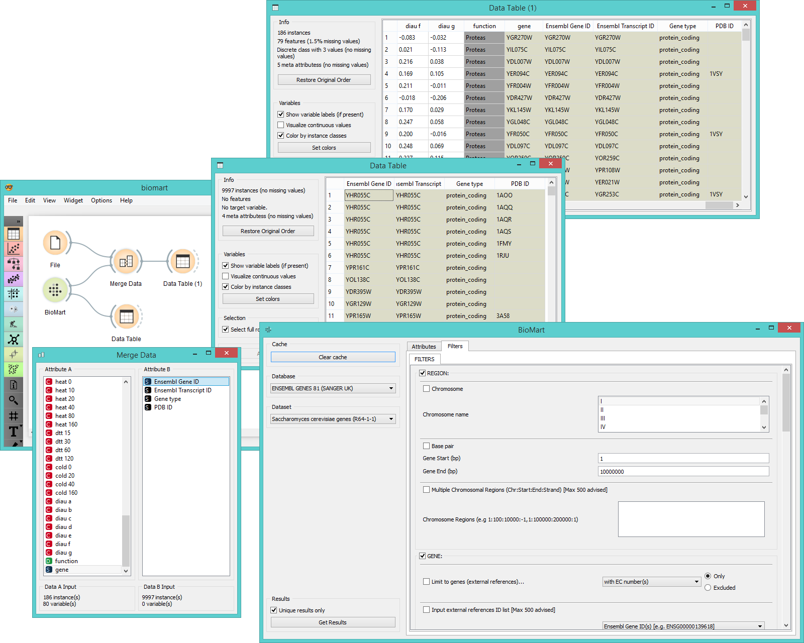

BioMart
=======

Gives access to [**BioMart**](http://www.biomart.org/news.html) databases.

Signals
-------

**Inputs**:

- None.

**Outputs**:

- **Data**

  Data set.

Description
-----------

**BioMart** is a widget for  direct access to [**BioMart**](http://www.biomart.org/news.html) databases. It
sources data from BioMart, filters it by categories (gene, region, phenotype, gene ontology, etc.) and
appends selected attributes in the output (IDs, sources, strains, etc.). Read more on the BioMart database
library [here](http://nar.oxfordjournals.org/content/43/W1/W589.full.pdf+html).

1. Clear cached data.
2. Select the database to source your data from.
3. Select the dataset (organism) to source your genes from.
4. If *Unique results only* is ticked, the widget will prevent data duplication. Click *Get results* to output the data.
5. Set the output:
   - in **Attributes** you set the meta data you wish to output (e.g. IDs, sources, strains...).
   - in **Filter** you filter the data by gene, phenotype, ontology, protein domains, etc.

Example
-------

**BioMart** is a great widget for appending additional information to your data. We used *brown-selected* data
in the **File** widget. Then we selected *Ensembl genes 81 (Sanger UK)* database to source our additional data
from. We decided to append *Ensembl Gene ID*, *Ensembl Transcript ID*, *gene type* and *PDB ID*. We also filtered
the data to output only those genes that can be found on chromosome I. We got 9997 instances with 4 meta attributes.
Then we used **Merge Data** widget to append these metas to our data. We matched the data by gene/Ensemble gene ID
and in the end we got a merged data table with 5 meta attributes.

